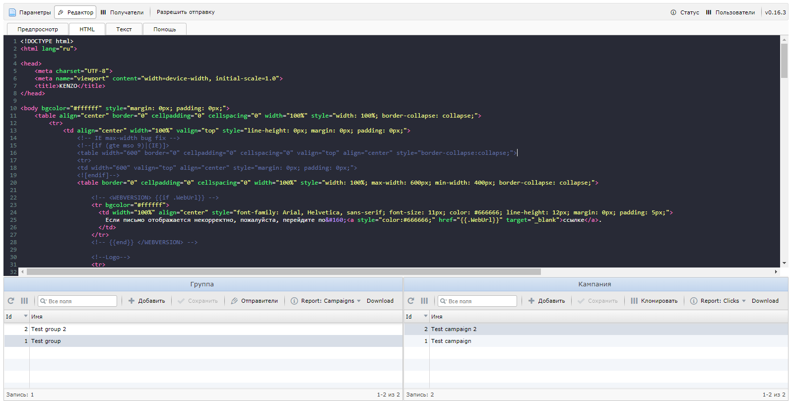

Gonder
======
[](https://goreportcard.com/report/github.com/Supme/gonder)
[](https://app.fossa.io/projects/git%2Bgithub.com%2FSupme%2Fgonder?ref=badge_shield)

Mass sender

Tools mass email lists, personalization, logging receipt, opening referrals.

Written on Golang



### Opportunities:
* Multithreaded distribution.
* Mailing profiles (choice of network interface, number of mailing threads, pauses between resending letters one at a time and the number of resending attempts).
* Ability to send via SOCKS5.
* Template engine with all the resulting personalization of letters.
* Web version of the letter.
* Unsubscribe functionality with the ability to change the unsubscribe pages for each group.
* Separate campaign groups, each with their own senders.
* Campaign statistics (email openings, link clicks, unsubscribes).
* Web control panel working through API.
* Full differentiation of access rights by groups and actions in the API / panel.

### Requirements:
* MySQL or similar database.
* Linux, Windows (full testing is done on Linux, running on Windows is only infrequently tested).
* The existence and correct entry of SPF / DKIM / DMARK records in the DNS of the domain on behalf of which the mailing is carried out.
* The existence of a mailbox on whose behalf mailing lists are conducted.
* Existence and correctly specified direct and reverse records of the IP address and its correspondence to the one specified in the mailing profile.
* Compliance with the general requirements for honest and legal mailings.

### Run
Use dist_config.ini as example config

Create certificates (use README.md) in "cert" folder.

Get database dump for MySQL/MariaDb github https://raw.githubusercontent.com/Supme/gonder/master/dump.sql

or initialize database command:
```shell script
./gonder -i
```

```shell script
Usage of ./gonder:
  -c  	    Path to config file (default "./dist_config.ini")
  -p        Path to certificate pem file (default "./cert/server.pem")
  -k        Path to certificate key file (default "./cert/server.key")
  -l        Path to log folder (default "./log")
  -i	    Initial database
  -iy  	    Initial database without confirm
  -v	    Prints version

```

Open in browser ```https://[host]:[api_port][panel_path]```

Default admin user for panel: admin:admin

### Docker
Build:
```shell script
git clone https://github.com/Supme/gonder.git
cd gonder
docker build -t gonder .
```

Or use dockerhub:
```shell script
docker pull supme/gonder
```

Run:
```shell script
docker run -d -i -t --rm --network host --name gonder \
-e GONDER_MAIN_DEFAULT_PROFILE_ID=1 \
-e GONDER_DATABASE_STRING='gonder:gonderpass@tcp(127.0.0.1:3306)/gonderdb' \
-e GONDER_MAILER_SEND=true \
-e GONDER_UTM_DEFAULT_URL='http://localhost:8080' \
-e GONDER_UTM_TEMPLATES_DIR='./templates' \
-e GONDER_UTM_FILES_DIR='./files' \
-e GONDER_UTM_PORT=8080 \
-e GONDER_API_PORT=7777 \
-e GONDER_API_PANEL_PATH='/panel' \
-e GONDER_API_PANEL_LOCALE='ru-ru' \
-v files:/app/files \
gonder
```

## License
Distributed under MIT License, please see license file in code for more details.

[](https://app.fossa.io/projects/git%2Bgithub.com%2FSupme%2Fgonder?ref=badge_small)